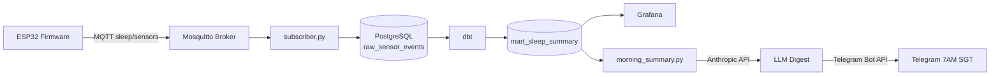

# Sleep Environment Monitor

Full-stack IoT sleep environment monitor.

```
ESP32 + BME280 + INMP441 + SSD1306
  → TinyML snore classifier (Edge Impulse)
  → MQTT (Mosquitto, Oracle Cloud)
  → PostgreSQL
  → dbt (staging → intermediate → mart)
  → Grafana dashboard
  → LLM morning summary → Telegram (7AM SGT)
```

## Architecture



## Repo Structure

```
firmware/          PlatformIO ESP32 project
data_pipeline/
  simulator/       Fake sensor publisher (dev/testing)
  subscriber/      MQTT → PostgreSQL writer
  dbt/             Three-layer dbt models
ml/                Edge Impulse TinyML artifacts
summary_bot/       LLM morning summary + Telegram
grafana/           Dashboard export JSON
docs/              Architecture diagrams
```

## MQTT Payload

Topic: `sleep/sensors`

```json
{
  "temperature": 26.5,
  "humidity": 79.0,
  "pressure": 1012.0,
  "snore_detected": 0,
  "timestamp": 1234567890.0
}
```

## Stack

| Layer | Tech |
|---|---|
| Firmware | C++ / PlatformIO / ESP32 WROOM-32D |
| Broker | Mosquitto on Oracle Cloud A1.Flex (Ubuntu 22.04 ARM) |
| Ingestion | Python / paho-mqtt / psycopg2 |
| Database | PostgreSQL |
| Transform | dbt-postgres |
| Viz | Grafana |
| Summary | Anthropic API + Telegram Bot API |
| ML | Edge Impulse (TinyML snore classifier) |
